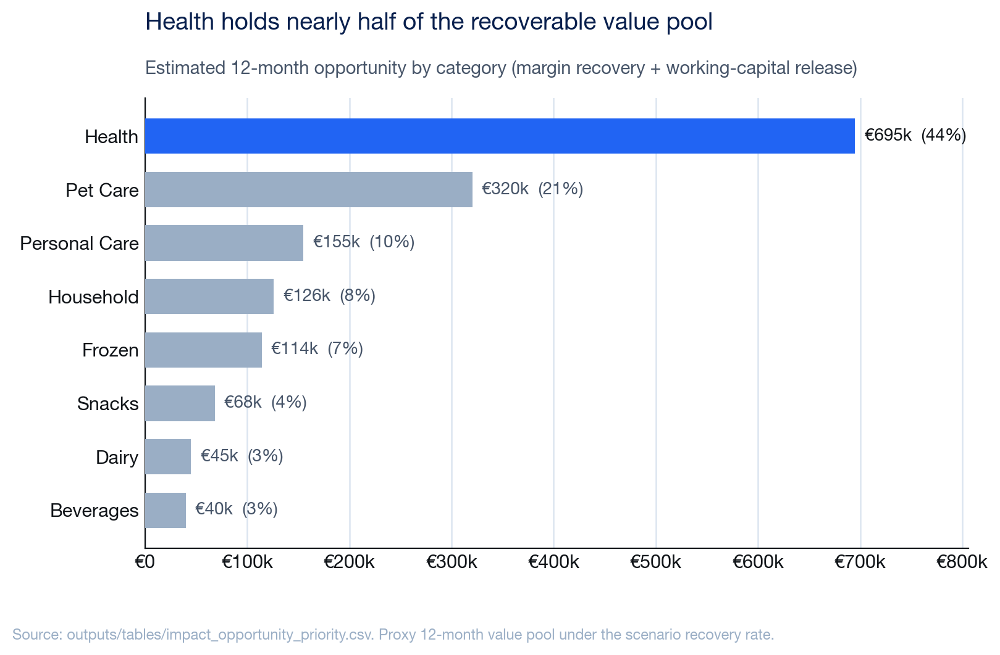
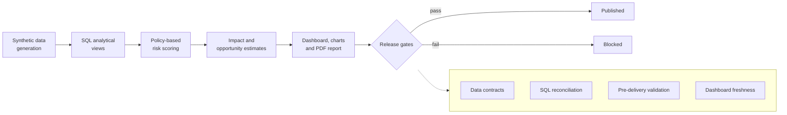

# Supply Chain Service Level and Inventory Intelligence

[](https://github.com/mfidalgomartins/supply-chain-service-inventory-intelligence/actions/workflows/analytics-ci.yml)
[](https://github.com/mfidalgomartins/supply-chain-service-inventory-intelligence/actions/workflows/analytics-ci.yml)
[](https://www.python.org/)
[](https://docs.astral.sh/ruff/)
[](LICENSE)

A reproducible decision-support pipeline that identifies where stockouts,
supplier instability, and excess inventory create the largest service and
working-capital exposure across a multi-warehouse network.

[](https://mfidalgomartins.github.io/supply-chain-service-inventory-intelligence/)
[](https://github.com/mfidalgomartins/supply-chain-service-inventory-intelligence/blob/main/outputs/reports/service_inventory_intelligence_report.pdf)

The dashboard is the primary artefact — an interactive, filterable operating
review with light/dark themes, sortable priority tables, and drill-down
charts, all served as a single static `index.html`. The chart below is one of
14 static exhibits also published from the same pipeline.



The reproducible synthetic dataset covers **120 products, 12 suppliers, 4
warehouses, and 731 daily observations from 2024-01-01 to 2025-12-31**. The
current scenario reports a **95.96% fill rate**, **€20.3M observed lost-sales
exposure**, and a **€1.64M directional 12-month opportunity proxy**.

## Decisions Supported
- Prioritize SKU-location interventions by service, stockout, supplier, and inventory risk.
- Identify suppliers and warehouses associated with the largest downstream exposure.
- Find excess inventory that can be reviewed without applying broad stock reductions.
- Quantify lost-sales margin and releasable working-capital scenarios.

## Analytical Flow
```text
reproducible synthetic data
  -> SQL analytical views
  -> policy-based risk scoring
  -> impact estimates
  -> dashboard, publication charts, and analytical report
  -> contract, SQL, analytical, and publication gates
```



The priority score is policy-based and fully documented. Financial values are
labelled as proxy estimates and are not presented as audited P&L or causal
attribution.

## Engineering Highlights
- **97.8% test coverage** across 59 tests, with a 95% floor enforced in CI —
  including an in-process, end-to-end pipeline test, not just isolated units.
- **Byte-identical reproducibility**: the pipeline is deterministic across
  Python and NumPy versions, verified by idempotent regeneration checks on
  both the dashboard and the PDF report.
- **Supply-chain security**: the dashboard's CDN-loaded Plotly bundle is
  pinned with a Subresource Integrity hash; dependencies are scanned with
  `pip-audit` on every run; the lint suite includes flake8-bandit rules.
- **WCAG AA-verified design system**: a dedicated 26-check contrast test
  guards the dashboard's light/dark colour tokens against regression.
- **Zero-tolerance release gate**: CI blocks publication on any pipeline
  failure, high-severity data-quality warning, or stale dashboard artefact.
- **Full static typing** (mypy) and formatting (ruff) enforced across the
  entire `src/` and `tests/` tree.

## Run Locally
Requires Python 3.12 or newer.

```bash
python3 -m venv .venv
.venv/bin/python -m pip install -r requirements.txt
.venv/bin/python src/run_pipeline.py
.venv/bin/python -m pytest -q
```

The repository intentionally does not version pipeline-generated CSV files.
Running the pipeline rebuilds `data/raw/`, `data/processed/`, and
`outputs/tables/`, then refreshes the tracked dashboard, charts, and PDF report.

### Developer Tooling
Install the quality toolchain and run the same gates CI enforces:

```bash
.venv/bin/python -m pip install -r requirements-dev.txt
.venv/bin/ruff check src tests          # lint (incl. flake8-bandit security rules)
.venv/bin/ruff format --check src tests  # formatting
.venv/bin/mypy                           # static type check
.venv/bin/pip-audit -r requirements.txt  # dependency vulnerability audit
.venv/bin/python -m pytest               # tests + 95% coverage floor
```

## Quality Controls
- Data contracts cover required columns, grain, nulls, ranges, domains, and key references.
- SQL and Python checks reconcile service, inventory, impact, scoring, and dashboard metrics.
- Linting (ruff, with security rules), formatting, and static typing (mypy) are enforced in CI.
- Tests run end-to-end and unit logic with an enforced 95% coverage floor.
- Dependencies are audited for known vulnerabilities (`pip-audit`) on every run.
- The published dashboard pins the Plotly bundle with a Subresource Integrity hash.
- Float serialisation is rounded so dashboard output is byte-identical across Python versions.
- CI runs the full pipeline, all of the above gates, and a dashboard freshness check.
- The release gate blocks publication on any failure or high-severity warning.

## Documentation
- [Methodology](docs/methodology.md)
- [Data model](docs/data_model.md)
- [Metric dictionary](docs/metric_dictionary.md)
- [Scoring framework](docs/scoring_framework.md)
- [Release governance](docs/release_governance.md)
- [ADR: single-file templates](docs/adr_single_file_templates.md)
- [Changelog](CHANGELOG.md)

## Repository Layout
```text
configs/   data-contract definitions
docs/      methodology and analytical documentation
sql/       schema, analytical views, KPI queries, and validation queries
src/       generation, transformation, scoring, publication, and gates
tests/     focused unit tests for critical logic
outputs/   tracked publication charts and analytical report
index.html GitHub Pages dashboard
```

## Limitations
- The dataset is synthetic and does not represent a specific company.
- Composite scores support prioritization; they do not prove root cause.
- Financial opportunity metrics are directional scenario estimates.
- The static dashboard loads the pinned Plotly bundle from a CDN, verified at
  load time with a Subresource Integrity (SHA-384) hash so a tampered or
  substituted payload is rejected by the browser.

## Stack
Python, pandas, NumPy, DuckDB, SQL, JavaScript, HTML, CSS.

## Contributing
See [CONTRIBUTING.md](CONTRIBUTING.md) for the validation and pull-request
workflow.
