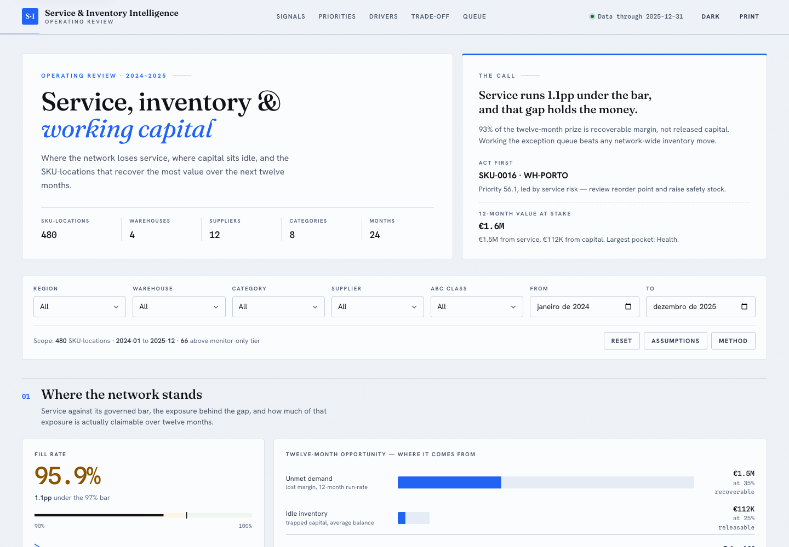
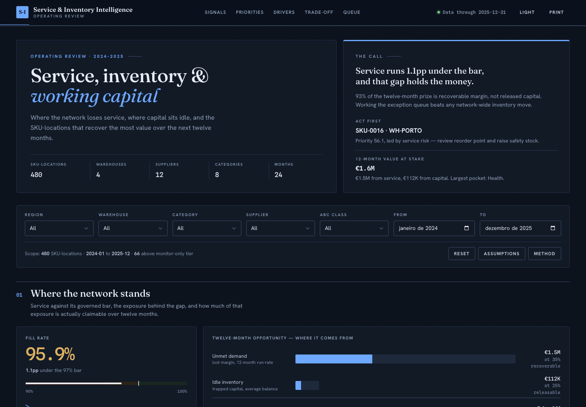
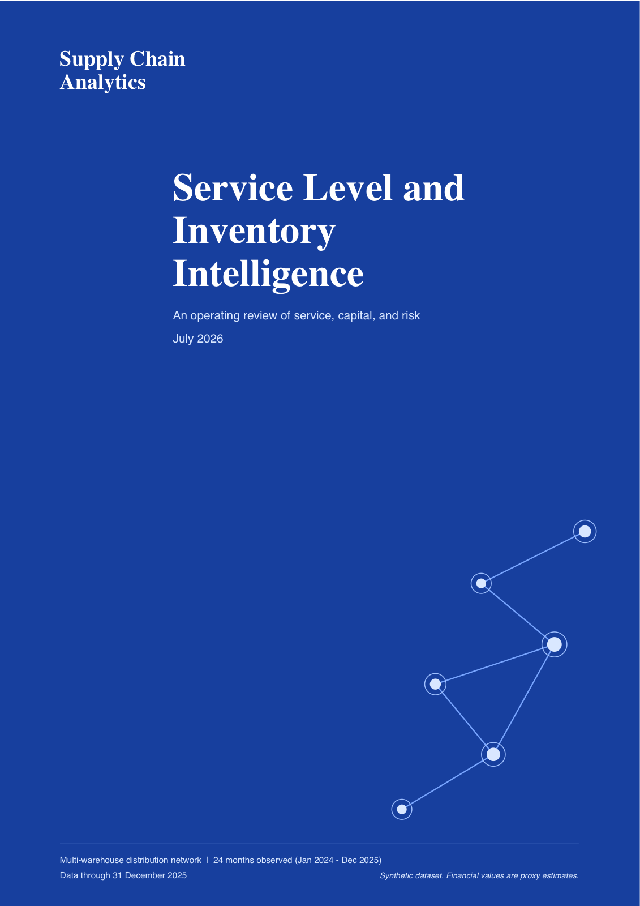
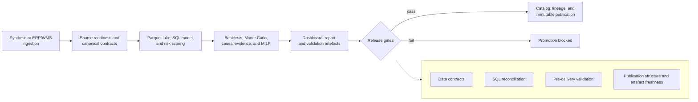

# Supply Chain Service Level and Inventory Intelligence

[](https://github.com/mfidalgomartins/supply-chain-service-inventory-intelligence/actions/workflows/analytics-ci.yml)
[](https://github.com/mfidalgomartins/supply-chain-service-inventory-intelligence/actions/workflows/analytics-ci.yml)
[](https://www.python.org/)
[](https://docs.astral.sh/ruff/)
[](LICENSE)

A reproducible decision-support pipeline that identifies where stockouts,
supplier instability, and excess inventory create the largest service and
working-capital exposure across a multi-warehouse network, validates inventory
policies through temporal backtests, evaluates registered interventions, and
optimizes constrained multi-echelon flows.

[](https://mfidalgomartins.github.io/supply-chain-service-inventory-intelligence/)
[](https://github.com/mfidalgomartins/supply-chain-service-inventory-intelligence/blob/main/outputs/reports/service_inventory_intelligence_report.pdf)

**[Dashboard](#dashboard--the-interactive-operating-review) ·
[Report](#report--the-executive-decision-support-deliverable) ·
[Decisions supported](#decisions-supported) ·
[Analytical flow](#analytical-flow) ·
[Engineering highlights](#engineering-highlights) ·
[Documentation](#documentation)**

The reproducible synthetic dataset covers **120 products, 12 suppliers, 4
warehouses, and 731 days from 2024-01-01 to 2025-12-31**. The current scenario
reports a **95.94% fill rate**, **€19.3M observed lost-sales exposure**, and a
**€1.56M directional 12-month opportunity proxy**.

## Dashboard — the interactive operating review

The dashboard is the primary artefact: a single static `index.html`, filterable
by region, warehouse, category, supplier, ABC class, and date range, with
sortable priority tables, drill-down charts, an assumptions/method drawer for
every metric, a print layout, and light/dark themes driven by system
preference or a persisted toggle.

<table>
<tr>
<td width="50%"></td>
<td width="50%"></td>
</tr>
</table>

- **Signals → Priorities → Drivers → Trade-off → Queue** — five linked sections
  walk a reviewer from "where does the network stand" to "what should be
  actioned first," anchored by scroll-spy navigation.
- **Governed filtering** — region, warehouse, category, supplier, ABC class,
  and a date range all recompute the same underlying aggregates client-side.
- **Claim-safe by design** — every financial figure is labelled a proxy
  estimate with an inline "Method" explanation; nothing is presented as
  audited P&L or a forecast.
- **Hardened static delivery** — the pinned Plotly bundle is loaded with a
  Subresource Integrity (SHA-384) hash, so a tampered or substituted script is
  rejected by the browser; 26 automated checks guard WCAG AA contrast in both
  themes.
- **Deterministic publication** — seeded generation and stabilized float
  serialization keep the dashboard byte-identical across Python 3.12–3.14.

[**Open the live dashboard →**](https://mfidalgomartins.github.io/supply-chain-service-inventory-intelligence/)

## Report — the executive decision-support deliverable

The analytical report is the leave-behind: a consulting-grade PDF that opens
the same scenario the dashboard shows, states the call in the first two pages,
and backs it with page-by-page evidence.



- **Same numbers, narrative form** — the report and dashboard are built from
  one pipeline run, so the exposure, opportunity, and priority figures always
  agree.
- **Decision-first structure** — the call and the recommended first action
  lead the report; category, supplier, and warehouse evidence follow.
- **Declared limitations** — every projection states what it does and does not
  prove, including which figures are causal, quasi-causal, or observational.
- **Regression-guarded layout** — a structural test checks page count and
  section anchors on every pipeline run, so the report can't silently
  regress to blank or malformed pages.

[**Read the analytical report →**](https://github.com/mfidalgomartins/supply-chain-service-inventory-intelligence/blob/main/outputs/reports/service_inventory_intelligence_report.pdf)

## Decisions Supported

- Prioritize SKU-location interventions by service, stockout, supplier, and inventory risk.
- Identify suppliers and warehouses associated with the largest downstream exposure.
- Find excess inventory that can be reviewed without applying broad stock reductions.
- Quantify lost-sales margin and releasable working-capital scenarios.
- Validate reorder-point and safety-stock policies on unseen time windows.
- Select non-dominated inventory policies under probabilistic service and capital constraints.
- Track intervention status, score migration, and observed pre/post benefit.
- Separate randomized causal estimates, DiD evidence, and observational movement.
- Allocate supplier and inter-warehouse flows subject to MOQ, sourcing, service,
  lane, and storage constraints.

## Analytical Flow
```text
synthetic or ERP/WMS extracts
  -> source freshness, schema-drift, key, and contract gates
  -> canonical data and incremental Parquet storage
  -> SQL analytical views
  -> policy-based risk scoring
  -> impact estimates
  -> walk-forward backtests and Monte Carlo optimization
  -> action tracking, causal evaluation, and multi-echelon MILP
  -> dashboard, publication charts, and analytical report
  -> contract, SQL, analytical, and publication gates
  -> catalog, lineage, and immutable object publication
```



The priority score is policy-based and fully documented. Dashboard financial
values are labelled as proxy estimates and are not presented as audited P&L.
Registered causal outputs carry separate design and evidence-status fields.

## Engineering Highlights

- **Decision-grade inventory policies**: four leakage-safe temporal folds compare
  three reorder and safety-stock policies for every SKU-location.
- **Probabilistic optimization**: deterministic Monte Carlo simulation reports
  service distributions, capital exposure, constraint outcomes, and an efficient
  frontier using a moving-block demand bootstrap.
- **Operational closed loop**: a lifecycle-aware action register measures score
  migration and realized pre/post benefit without claiming causal attribution.
- **Registered causal evidence**: a stratified RCT and a DiD supplier-recovery
  cohort produce cluster-level effects, uncertainty, randomization inference,
  pre-trend/placebo diagnostics, and claim-safe evidence statuses.
- **Multi-echelon optimization**: a sparse HiGHS MILP minimizes procurement,
  transfer, holding, shortage, and order costs while enforcing physical network constraints.
- **Production-shaped ingestion**: configurable canonical-directory and ERP/WMS
  adapters support 11 CSV or Parquet exports, column mapping, ownership, freshness
  SLAs, schema fingerprints, and fail-before-overwrite validation.
- **Incremental analytical storage**: key-based Parquet upserts, source hashes,
  watermarks, compression, schema-drift checks, and hash-verified idempotent skips.
- **End-to-end regression coverage**: CI enforces a 95% line-coverage floor and
  executes the complete pipeline in-process.
- **Governed SQL boundary**: raw CSVs load through the typed DuckDB schema,
  where primary keys and operational constraints fail before transformation.
- **Deterministic publication**: seeded generation and stabilized float
  serialization keep the dashboard byte-identical across Python 3.12-3.14;
  charts and the PDF have structural and semantic release checks.
- **Hardened static delivery**: Plotly is pinned with Subresource Integrity,
  dependencies are audited, and GitHub Actions run read-only at commit-pinned revisions.
- **Contrast regression coverage**: 26 checks protect the light and dark theme
  text tokens against WCAG AA contrast regressions.
- **Enforced release policy**: failures, high-severity warnings, missing or
  malformed publications, and a stale dashboard block release.
- **Observable scheduled runs**: a dependency-validated DAG emits JSONL events and
  a run summary, retries only classified transient failures, and promotes `latest`
  only after every gate passes.
- **Portable governed publication**: local and S3-compatible backends use
  content-addressed immutable objects, SHA-256 verification, server-side
  encryption settings, a data catalog, and validated lineage.
- **Automated code checks**: ruff formatting/linting and mypy analysis cover
  the complete `src/` and `tests/` trees.

## Run Locally
Requires Python 3.12 or newer.

```bash
python3 -m venv .venv
.venv/bin/python -m pip install -r requirements-dev.txt
.venv/bin/python -m src
.venv/bin/python -m pytest -q
```

The repository intentionally does not version pipeline-generated CSV or Parquet files.
Running the pipeline rebuilds `data/raw/`, `data/processed/`, `data/lake/`, and
`outputs/tables/`, refreshes the tracked dashboard, charts, and PDF report, and
publishes the governed table set under `data/object_store/` by default. The run
summary and structured event log are written to `outputs/`.

For S3-compatible publication, use the standard AWS credential chain and set:

```bash
export OBJECT_STORE_BACKEND=s3
export S3_BUCKET=analytics-production
export S3_PREFIX=supply-chain-intelligence
export AWS_REGION=eu-west-1
.venv/bin/python -m src
```

`S3_ENDPOINT_URL` can target a compatible private object store. Credentials are
never read from configuration or written to telemetry.

### Developer Tooling
Install the quality toolchain and run the same gates CI enforces:

```bash
.venv/bin/python -m pip install -r requirements-dev.txt
.venv/bin/ruff check src tests          # lint (incl. flake8-bandit security rules)
.venv/bin/ruff format --check src tests  # formatting
.venv/bin/mypy                           # static type check
.venv/bin/pip-audit -r requirements-dev.txt  # dependency vulnerability audit
.venv/bin/python -m pytest               # tests + 95% coverage floor
```

## Quality Controls
- Data contracts cover required columns, grain, nulls, ranges, domains, and key references.
- Source gates cover required schemas, breaking/additive drift, business keys,
  accountable ownership, and watermark freshness before canonical replacement.
- Backtest gates enforce time separation and inventory-flow conservation.
- Simulation gates enforce probability bounds, conservation, and efficient-frontier selection.
- Storage gates verify current source and Parquet hashes, key integrity, and
  contract coverage for every persisted table.
- Action gates reconcile benefit components and prevent causal claims from pre/post evidence.
- Causal gates restrict causal labels to randomized designs, quasi-causal labels
  to DiD, and supported claims to experiments with clean diagnostics.
- Network gates independently reconcile flow conservation, service attainment,
  capacities, solver status, and optimality gap.
- SQL and Python checks reconcile service, inventory, impact, scoring, and dashboard metrics.
- Linting (ruff, with security rules), formatting, and static typing (mypy) are enforced in CI.
- Tests run end-to-end and unit logic with an enforced 95% coverage floor.
- Dependencies are audited for known vulnerabilities (`pip-audit`) on every run.
- The published dashboard pins the Plotly bundle with a Subresource Integrity hash.
- Float serialisation is rounded so dashboard output is byte-identical across Python 3.12-3.14.
- CI runs the full pipeline, validates publication structure, and checks
  dashboard, chart, and PDF freshness.
- A weekly/manual workflow runs the same canonical entry point and uploads run
  telemetry, lineage, catalog, publication manifest, and latest pointer.
- The release gate blocks publication on any failure or high-severity warning.

## Documentation
- [Methodology](docs/methodology.md)
- [Data model](docs/data_model.md)
- [Metric dictionary](docs/metric_dictionary.md)
- [Scoring framework](docs/scoring_framework.md)
- [Advanced decision intelligence](docs/advanced_analytics.md)
- [Release governance](docs/release_governance.md)
- [Production design](docs/planning/strategic-expansions-design.md)
- [Implementation roadmap](docs/planning/strategic-expansions-plan.md)
- [ADR: presentation templates](docs/adr_presentation_templates.md)
- [Changelog](CHANGELOG.md)

## Repository Layout
```text
configs/   source, analytics, optimization, orchestration, and contract policy
docs/      methodology and analytical documentation
sql/       schema, analytical views, KPI queries, and validation queries
src/       ingestion, analytics, causal inference, optimization, orchestration, and gates
templates/ static dashboard HTML/CSS/JavaScript template
tests/     focused unit tests for critical logic
outputs/   tracked publication charts and analytical report
index.html GitHub Pages dashboard
```

## Limitations
- The dataset is synthetic and does not represent a specific company.
- Composite scores support prioritization; they do not prove root cause.
- Financial opportunity metrics are directional scenario estimates.
- Backtests and Monte Carlo scenarios support policy decisions; they are not forecasts.
- Action-register pre/post benefits remain observational. Only registered RCT or
  DiD outputs use causal or quasi-causal labels, and only when their diagnostics permit it.
- The MILP is a deterministic planning model over the configured horizon; it is
  not a stochastic network design or an ERP execution engine.
- The static dashboard loads the pinned Plotly bundle from a CDN, verified at
  load time with a Subresource Integrity (SHA-384) hash so a tampered or
  substituted payload is rejected by the browser.

## Stack
Python, pandas, NumPy, SciPy/HiGHS, DuckDB, Boto3, SQL, JavaScript, HTML, CSS.

## Contributing
See [CONTRIBUTING.md](CONTRIBUTING.md) for the validation and pull-request
workflow.
