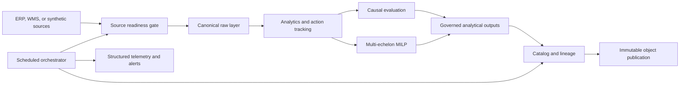

# Strategic Expansions: Production Design

**Status:** Approved on 2026-07-14  
**Scope:** Source-system readiness, causal intervention evaluation, multi-echelon
inventory optimization, and scheduled observable publication  
**Design constraint:** Preserve the dashboard and report visual design.

## Outcome

Extend the existing deterministic analytics pipeline into a deployable decision
system that can safely accept ERP/WMS extracts, distinguish causal evidence from
observational movement, optimize inventory across a constrained network, and
publish governed run artefacts to local or S3-compatible object storage.

The default deployment remains fully executable from a clean clone. Cloud access
is optional and uses the same storage contract as the local backend.

## Architecture

The implementation extends the current pipeline rather than creating a second
execution path. `python -m src` remains the canonical local command. Scheduled
runs call the same orchestrator and publish the same contracted assets.

## 1. Governed ERP/WMS Pilot

### Input contract

Each canonical raw table receives an explicit source policy:

- source system and accountable owner;
- business watermark column, where applicable;
- freshness SLA in hours;
- required and optional canonical columns;
- allowed source-to-canonical mappings;
- severity for additive, removed, renamed, and type-changing drift.

Source policies are versioned in configuration. Observed schemas are fingerprinted
after mapping and before any canonical file is replaced. The prior successful
fingerprint is retained in the catalog.

### Readiness decision

The gate returns one row per check and table with `PASS`, `WARN`, or `FAIL`:

- file availability and readability;
- schema compatibility and drift class;
- business watermark freshness;
- key completeness and duplicate risk;
- cross-table reference readiness;
- source and canonical hashes.

Breaking drift, unreadable inputs, missing critical columns, stale blocker-level
facts, or invalid business keys fail before publication. Additive drift is visible
but non-blocking unless the policy says otherwise. Synthetic runs use the configured
simulation as-of date, preventing wall-clock staleness from invalidating a
reproducible portfolio build.

### Outputs

- `outputs/tables/source_readiness_checks.csv`
- `outputs/tables/source_schema_registry.csv`
- `outputs/tables/source_schema_drift_events.csv`

These outputs are contracted, catalogued, and included in the release gate.

## 2. Causal Intervention Evaluation

### Estimand and unit

The primary estimand is the average treatment effect on the treated for operational
outcomes such as fill rate, stockout rate, lost-margin proxy, and average inventory
value. The experimental unit is a SKU-location or supplier cohort, never an
individual demand row.

### Supported designs

**Randomized controlled pilot**

- validate deterministic treatment assignment, group sizes, uniqueness, and
  pre-treatment balance;
- estimate cluster-level difference in post-minus-pre outcomes;
- calculate uncertainty and a randomization-inference p-value;
- publish causal language only when assignment and diagnostic gates pass.

**Difference-in-differences**

- compare treated and control cohort changes over common pre/post windows;
- estimate uncertainty at the intervention-unit level;
- test differential pre-period slopes and a pre-period placebo;
- downgrade attribution when support, parallel trends, or measurement quality fail.

Statistical effects and economic value remain separate fields. Inconclusive or
invalid designs publish an evidence status rather than manufacturing a result.

### Reference evidence

The deterministic synthetic network includes:

- a stratified randomized inventory-policy pilot with an operationally embedded
  treatment;
- a supplier recovery intervention suitable for a difference-in-differences
  comparison.

The generator records assignment before outcomes. The evaluation never reads a
hidden true effect; tests verify recovery against the known simulation mechanism.

### Outputs

- `outputs/tables/causal_effect_estimates.csv`
- `outputs/tables/causal_diagnostics.csv`
- `outputs/tables/causal_cohort_timeseries.csv`

## 3. Multi-Echelon Inventory Optimization

### Network model

The network contains supplier nodes, gateway/distribution nodes, regional demand
nodes, enabled transport lanes, and product-source eligibility. The planning
horizon is configurable and demand is derived from observed history without using
future data.

Decision variables cover integer product flow on each eligible lane, binary order
activation for MOQ enforcement, ending inventory, and unmet demand. The deterministic
MILP is solved through SciPy's HiGHS-backed optimizer.

### Objective

Minimize total system cost:

- procurement and order activation;
- transport and transfer;
- ending-inventory holding cost;
- lost-margin shortage penalty.

The objective is global. No warehouse can improve its local position by violating
flow conservation or moving cost and risk to another node invisibly.

### Constraints

- node-level inventory flow conservation;
- supplier-product sourcing eligibility and capacity;
- supplier/product MOQ linked to order activation;
- lane capacity and enabled-lane restrictions;
- warehouse storage capacity;
- service-level shortage bounds;
- non-negative integer physical flows.

Solver status, optimality gap, conservation residuals, capacity utilization, and
service attainment are release-gated. Infeasible models fail with diagnostics and
never publish a partial recommendation as an optimal plan.

### Outputs

- `outputs/tables/network_optimization_plan.csv`
- `outputs/tables/network_flow_plan.csv`
- `outputs/tables/network_constraint_utilization.csv`
- `outputs/tables/network_optimization_summary.csv`

## 4. Orchestration, Storage, Lineage, and Telemetry

### Orchestrator

The current subprocess runner becomes a dependency-aware orchestrator with:

- explicit stage dependencies and stage-owned outputs;
- deterministic run identifiers derived from source and configuration hashes;
- bounded exponential retry for explicitly transient I/O failures only;
- fail-fast handling for data, model, and contract errors;
- structured start, success, retry, and failure events;
- persisted per-stage duration and run outcome.

Retries do not mask deterministic defects. A run publishes its `latest` pointer
only after every release gate succeeds.

### Object storage

A small `ObjectStore` protocol supports:

- immutable content-addressed writes;
- verified reads using SHA-256 metadata;
- manifest publication;
- atomic or last-step promotion of the run pointer.

`LocalObjectStore` is the executable default. `S3ObjectStore` uses Boto3 and accepts
bucket, prefix, endpoint, region, and server-side encryption settings without
embedding credentials. Dependency injection allows the S3 behavior to be tested
without live infrastructure.

### Catalog and lineage

Every published table or artefact records:

- logical asset and producing stage;
- physical path or object key;
- row count or byte size;
- schema and content hashes;
- business watermark where applicable;
- upstream assets and run identifier.

Lineage edges are declared by stages and validated so every derived asset has a
known producer and every referenced parent exists.

### Outputs

- `outputs/tables/data_catalog.csv`
- `outputs/tables/data_lineage.csv`
- `outputs/pipeline_run_summary.json`
- `outputs/pipeline_run_events.jsonl`
- immutable objects under the configured local or S3 prefix

Operational telemetry is a final run artefact, not a tracked publication. CI uploads
it for diagnosis while deterministic analytical publications remain reproducible.

## Configuration and Compatibility

`configs/pipeline.json` moves to schema version 2 and adds four validated sections:
`source_governance`, `causal_evaluation`, `network_optimization`, and
`orchestration`. Environment variables may select the adapter, object-store backend,
S3 endpoint/bucket, run as-of timestamp, and schedule context. Secrets are resolved
by the AWS credential chain and are never serialized.

All existing commands remain valid. New modules also expose narrow CLIs for testing
and operator use. Existing dashboard HTML, CSS, layout, colors, branding, charts,
and report templates are not redesigned.

## Failure Semantics

| Condition | Result |
|---|---|
| Missing or breaking source schema | Stop before canonical overwrite |
| Stale blocker-level source | Stop and publish readiness evidence |
| Additive source drift | Warn and continue when policy permits |
| Insufficient causal support | Publish `insufficient_evidence`; do not fail pipeline |
| Failed causal validity gate | Publish non-causal evidence status |
| Infeasible or unbounded MILP | Fail optimization; publish no recommended plan |
| Transient object-store error | Retry within configured bound |
| Data, model, or contract error | Fail immediately without retry |
| Failed release gate | Do not promote the object-store `latest` pointer |

## Verification Standard

- Test-first red-green-refactor for every new behavior.
- Unit tests for freshness, drift, causal validity, optimizer constraints, object
  immutability, retries, and lineage completeness.
- Integration test executes all new stages and validates contracted outputs.
- Existing publication design and freshness checks remain in force.
- Ruff, formatting, mypy, dependency audit, complete pipeline, SQL gates, and at
  least 95% branch-relevant line coverage pass on Python 3.12, 3.13, and 3.14.

## Accepted Trade-offs

- Local object storage is the default so the complete system is demonstrable without
  cloud credentials; S3 remains a real adapter, not pseudocode.
- The first network optimizer is deterministic. Existing Monte Carlo outputs continue
  to describe policy uncertainty without mixing stochastic simulation into the MILP.
- Causal estimators are deliberately narrow and diagnostic-heavy. Unsupported designs
  are rejected rather than hidden behind a generic regression interface.
